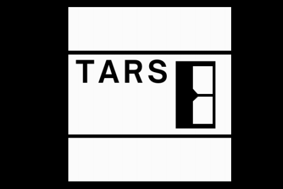
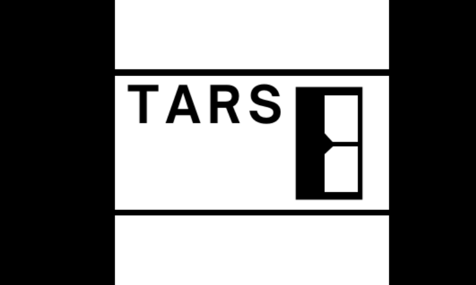
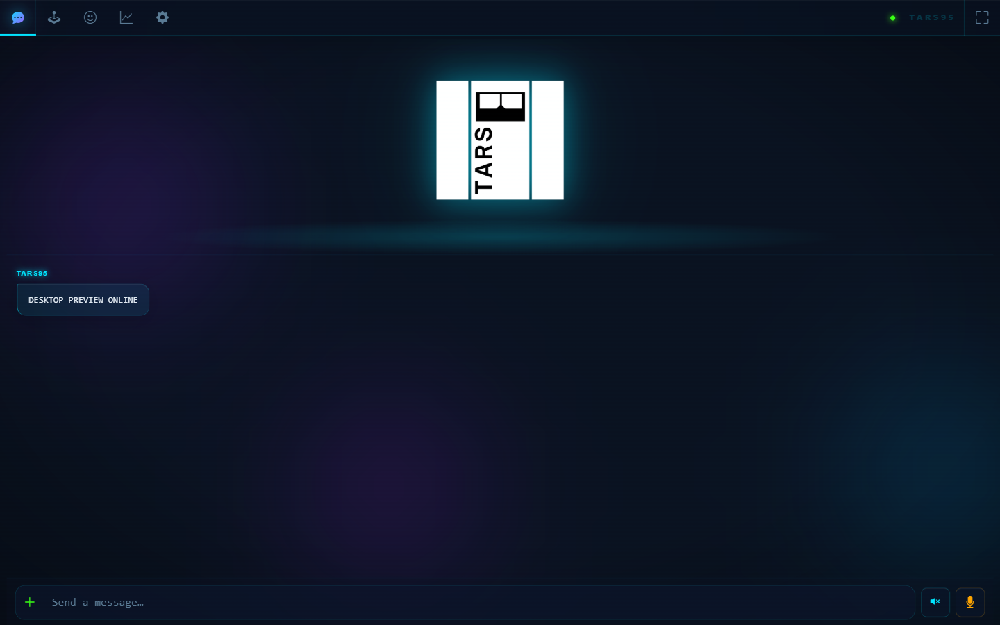
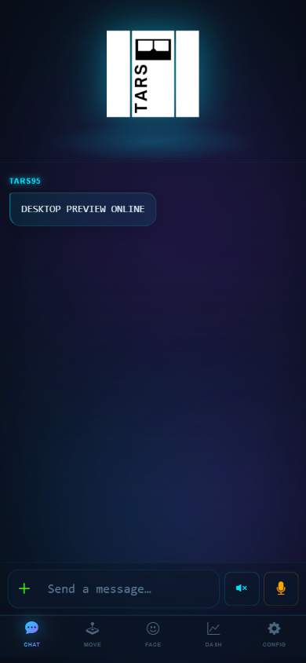

# UI-005 — Pre-redesign baseline

These four frames record the production UI immediately before the TARS/95 visual redesign begins. They are review references, not locked pixel-regression expectations; UI-031 will establish the approved regression set.

| Frame | Exact size | Surface |
| --- | ---: | --- |
| `device-480x320.png` | 480×320 | Real avatar app, production rotation |
| `device-800x480.png` | 800×480 | Real avatar app, production rotation |
| `web-desktop-1440x900.png` | 1440×900 | Production chat template at desktop viewport |
| `web-mobile-390x844.png` | 390×844 | Production chat template at phone viewport |

The device screenshots contain only the physical robot framebuffer. The web screenshots hide the preview-only fixture rail and neutralize the existing Google Fonts/Three.js CDN requests, recording the current offline fallback. All four use standby, 95% battery, no alert, and online connectivity.

## Reproduce

From the repository root in PowerShell:

```powershell
.\tools\ui-preview\setup.ps1
.\.venv-ui-preview\Scripts\python.exe .\tools\ui-preview\capture_baselines.py
```

The capture command starts and stops its own localhost server, uses installed Chrome with Edge as fallback, checks browser console errors, verifies exact PNG dimensions, and rewrites `manifest.json` with SHA-256 hashes.

## Review

### Device — 480×320



### Device — 800×480



### Web — desktop 1440×900



### Web — mobile 390×844


